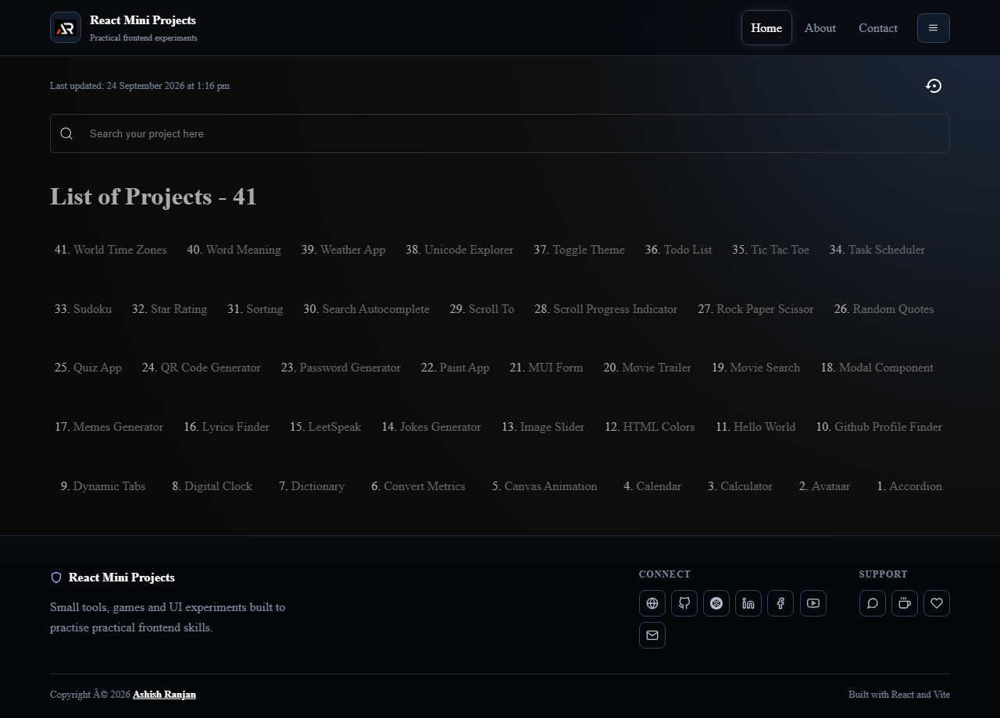

# React Mini Projects

A searchable collection of practical React mini-projects, games, utilities and frontend experiments. Each route focuses on one small idea, from calculators and forms to API-driven tools and visual demos.

## Features

- Searchable project directory with quick route navigation.
- Lazy-loaded mini apps for a fast initial screen.
- Responsive fixed header with a mobile project menu.
- Independent demos for UI patterns, games, utilities, APIs and browser features.
- Footer with icon-only social and support links.

## Tech Stack

React, Vite, React Router, Styled Components, Material UI, React Icons, Axios and selected browser/API utilities.

## Run locally

```bash
npm install
npm run dev
```

## Build and deploy

```bash
npm run lint
npm run build
npm run deploy
```

## Screenshot



## Links

- Portfolio: [https://www.ashishranjan.net/](https://www.ashishranjan.net/)
- GitHub: [https://github.com/a2rp](https://github.com/a2rp)
- CodePen: [https://codepen.io/ash1198](https://codepen.io/ash1198)
- LinkedIn: [https://www.linkedin.com/in/aashishranjan](https://www.linkedin.com/in/aashishranjan)
- Facebook: [https://www.facebook.com/theash.ashish/](https://www.facebook.com/theash.ashish/)
- YouTube: [https://www.youtube.com/@ashishranjan-ashz?sub_confirmation=1](https://www.youtube.com/@ashishranjan-ashz?sub_confirmation=1)
- Email: [ash.ranjan09@gmail.com](mailto:ash.ranjan09@gmail.com)

## Support

- Support: [https://a2rp-donation-page.netlify.app/](https://a2rp-donation-page.netlify.app/)
- Buy Me a Coffee: [https://buymeacoffee.com/a2rp](https://buymeacoffee.com/a2rp)
- Patreon: [https://www.patreon.com/a2rp](https://patreon.com/a2rp)